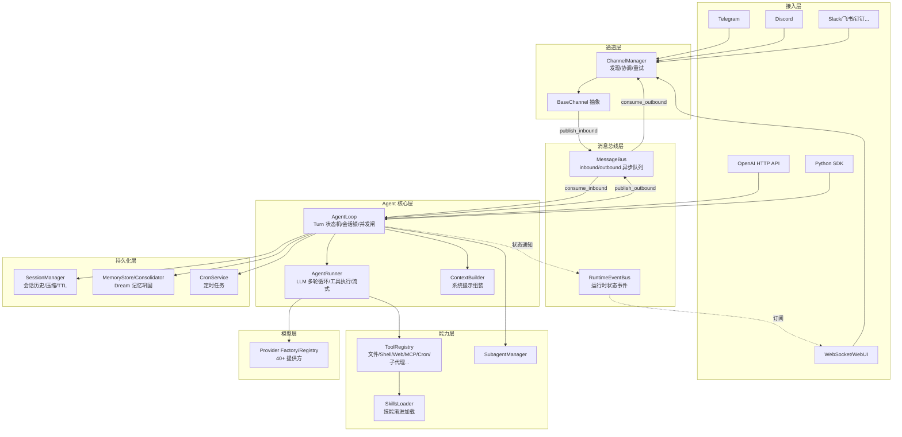

# nanobot 架构设计文档

> 版本：nanobot 0.2.2　|　文档语言：简体中文　|　视角：系统架构师
>
> 本文档基于源码静态分析撰写，目标是讲清 nanobot 的整体架构、核心子系统、运行时装配、数据流与关键设计决策，为二次开发、扩展集成与运维部署提供权威参考。

---

## 目录

1. [文档概述](#1-文档概述)
2. [系统定位与设计哲学](#2-系统定位与设计哲学)
3. [总体架构](#3-总体架构)
4. [核心数据流](#4-核心数据流)
5. [核心子系统详解](#5-核心子系统详解)
   - 5.1 [消息总线与运行时事件](#51-消息总线与运行时事件)
   - 5.2 [Agent 核心循环（AgentLoop）](#52-agent-核心循环agentloop)
   - 5.3 [LLM 执行器（AgentRunner）](#53-llm-执行器agentrunner)
   - 5.4 [LLM Provider 子系统](#54-llm-provider-子系统)
   - 5.5 [Channel 通道子系统](#55-channel-通道子系统)
   - 5.6 [Tools 工具子系统](#56-tools-工具子系统)
   - 5.7 [Memory 与 Session 子系统](#57-memory-与-session-子系统)
   - 5.8 [Context 构建](#58-context-构建)
   - 5.9 [Cron 调度服务](#59-cron-调度服务)
   - 5.10 [命令路由](#510-命令路由)
   - 5.11 [Skills 技能体系](#511-skills-技能体系)
6. [运行时装配与入口](#6-运行时装配与入口)
7. [WebUI 与通信协议](#7-webui-与通信协议)
8. [安全边界](#8-安全边界)
9. [配置体系](#9-配置体系)
10. [设计原则与约束](#10-设计原则与约束)
11. [关键设计决策与权衡](#11-关键设计决策与权衡)
12. [部署与扩展](#12-部署与扩展)
13. [附录](#13-附录)

---

## 1. 文档概述

### 1.1 目的

nanobot 是一个轻量级、开源的 AI Agent 框架，使用 Python（后端）+ React/TypeScript（WebUI）实现。它围绕一个精简的 Agent 循环构建：从聊天通道接收消息、调用 LLM 提供方、执行工具、管理会话记忆，并将响应回传至通道。

本文档从架构师视角，系统性地刻画 nanobot 的分层结构、子系统职责、关键交互流程与设计取舍，回答以下问题：

- 整体架构如何分层？各层职责边界在哪？
- 一条消息从进入到响应返回，完整经过哪些组件？
- 如何扩展新的通道、Provider、工具、技能？
- 哪些是核心路径（不可轻易改动），哪些是边缘扩展点？
- 安全边界、并发模型、持久化与容错如何保证？

### 1.2 读者

- 二次开发者：需理解扩展点与边界约束
- 集成方：需理解通道、Provider、API/SDK 接入方式
- 运维/SRE：需理解装配、部署、持久化与容错
- 架构评审：需理解设计原则与权衡

---

## 2. 系统定位与设计哲学

### 2.1 定位

nanobot 定位为**通用、可嵌入、多通道接入**的 AI Agent 运行时，而非单点应用。其能力包括：

- **多通道接入**：Telegram、Discord、Slack、飞书、企业微信、钉钉、QQ、微信、Matrix、WhatsApp、Email、MS Teams、WebSocket（WebUI）等 18+ 平台。
- **多模型适配**：40+ LLM Provider（Anthropic、OpenAI 系、Azure、Bedrock、各大国产与开源网关），统一抽象。
- **工具化执行**：文件系统、Shell、Web 搜索/抓取、MCP 服务器、Cron、子代理、长期任务、图像生成、自我修改等。
- **持久化记忆**：会话历史 + Dream 两阶段记忆巩固 + Git 化的灵魂/用户画像文件。
- **可编程接入**：CLI、Python SDK、OpenAI 兼容 HTTP API、WebUI 四种入口。

### 2.2 设计哲学

源码 `.agent/design.md` 明确了五条架构宪法，贯穿整个代码库：

| 原则 | 含义 | 在代码中的体现 |
|------|------|----------------|
| **核心保持精简，在边缘扩展** | 新能力应通过 channel/tool/skill/MCP 加入，而非内联进 Agent 循环 | `agent/loop.py` 与 `agent/runner.py` 是关键核心路径，改动需最小化且需正当理由 |
| **少些结构，多些智能** | 偏好简单可读代码，而非新的框架层与间接层 | 多数子系统用直白函数/数据类而非过度抽象 |
| **宁重复，不过早抽象** | 通道与 Provider 允许重复相似逻辑，不引入复杂基类消除重复 | 每个 channel 文件自包含、可独立阅读 |
| **最小改动解决真实问题** | 修 Bug 只改必要部分，不夹带无关重构 | PR 评审准则 |
| **显式优于魔法** | 配置必须在 Pydantic 模型中显式声明；错误显式抛出而非静默纠正 | Provider 自动检测存在，但每条解析路径都从 factory 可追溯到具体类 |

> **架构师注**：这套哲学直接决定了 nanobot 的"瘦核心 + 胖边缘"形态——核心循环极小且稳定，几乎所有能力都通过插件式发现机制挂在边缘。

---

## 3. 总体架构

### 3.1 分层架构

nanobot 采用**事件驱动 + 总线解耦**的分层架构：



### 3.2 关键架构特征

1. **单一总线解耦**：`MessageBus` 用两条 `asyncio.Queue`（inbound/outbound）彻底解耦通道与 Agent 核心，通道只负责"收"与"发"。
2. **双总线分离**：`MessageBus` 承载用户消息投递；`RuntimeEventBus` 承载进程内运行时状态通知（供 WebUI 等订阅），二者职责正交，互不污染。
3. **瘦核心**：`AgentLoop` + `AgentRunner` 是唯一核心路径，其余皆为可替换边缘。
4. **插件式发现**：Channel、Tool、Skill 均通过 `pkgutil` 扫描 + `entry_points` 插件机制自动发现，零手工注册。
5. **并发模型**：会话内串行（`asyncio.Lock`）、会话间并发（`Semaphore` 闸门，默认 3），兼顾隔离与吞吐。

---

## 4. 核心数据流

一条用户消息从到达通道到响应返回，完整经过以下流水线：

```mermaid
sequenceDiagram
    participant U as 用户
    participant CH as Channel
    participant BUS as MessageBus
    participant LOOP as AgentLoop
    participant RUN as AgentRunner
    participant PROV as LLM Provider
    participant TOOL as ToolRegistry
    participant SESS as Session

    U->>CH: 发送消息
    CH->>BUS: publish_inbound(InboundMessage)
    BUS->>LOOP: consume_inbound()
    LOOP->>LOOP: _dispatch(): 获取会话锁 + 并发闸
    Note over LOOP: Turn 状态机: RESTORE→COMPACT→COMMAND→BUILD→RUN→SAVE→RESPOND→DONE

    LOOP->>SESS: 恢复 checkpoint / 加载历史
    LOOP->>LOOP: COMPACT: TTL 自动压缩
    LOOP->>LOOP: COMMAND: 命令路由(priority/exact/prefix)
    LOOP->>LOOP: BUILD: ContextBuilder 组装 system prompt + 历史 + 当前消息
    LOOP->>RUN: _run_agent_loop(initial_messages)

    loop 多轮工具循环
        RUN->>PROV: 发送 messages + tools 定义
        PROV-->>RUN: 返回内容 / 工具调用 / 流式增量
        alt 有工具调用
            RUN->>TOOL: 并发执行工具
            TOOL-->>RUN: 工具结果
            RUN->>LOOP: 流式增量回调 (on_stream)
            RUN->>BUS: 发布进度/流式 OutboundMessage
        else 无工具调用
            RUN-->>LOOP: 最终内容
        end
    end

    LOOP->>SESS: SAVE: 持久化本轮 (原子写 history)
    LOOP->>LOOP: RESPOND: 组装 OutboundMessage
    LOOP->>BUS: publish_outbound(response)
    BUS->>CH: consume_outbound()
    CH-->>U: 投递响应
```

### 4.1 关键设计点

- **流式分段**：`on_stream` / `on_stream_end` 回调将一次回答切分为多个流式段（`stream_id`），每个工具调用间隙产生一个新段，使飞书等卡片式通道能实时更新。
- **轮中注入（Mid-turn injection）**：当某会话正在处理时，该会话的新消息不创建竞争任务，而是路由到 per-session pending queue，在工具间隙注入 LLM（`_drain_pending`），最多每轮 3 条、5 个循环。
- **崩溃恢复（Runtime checkpoint）**：工具执行期间通过 `_set_runtime_checkpoint` 将进行中的轮次状态写入会话 metadata，`/stop` 或崩溃后下一轮 `_restore_runtime_checkpoint` 物化部分上下文，避免丢失工具结果。

---

## 5. 核心子系统详解

### 5.1 消息总线与运行时事件

#### MessageBus（`nanobot/bus/queue.py`）

极简的异步解耦层，仅两条 `asyncio.Queue`：

```python
class MessageBus:
    inbound: asyncio.Queue[InboundMessage]
    outbound: asyncio.Queue[OutboundMessage]
```

- 通道通过 `publish_inbound` 投递用户消息，`AgentLoop` 通过 `consume_inbound` 消费。
- `AgentLoop` 通过 `publish_outbound` 投递响应，`ChannelManager` 通过 `consume_outbound` 消费并分发。
- **数据契约**：`InboundMessage`（channel/sender_id/chat_id/content/media/metadata/session_key_override）与 `OutboundMessage`（channel/chat_id/content/metadata/buttons）。`session_key` 默认为 `{channel}:{chat_id}`，支持 thread 级覆盖。

#### RuntimeEventBus（`nanobot/bus/runtime_events.py`）

与 MessageBus **正交**的第二条总线，承载进程内运行时状态通知（非用户消息）：

- 事件类型：`SessionTurnStarted`、`TurnRunStatusChanged`、`TurnCompleted`、`GoalStateChanged`、`RuntimeModelChanged` 等。
- 订阅者：WebUI 适配器（`WebuiTurnCoordinator`）等，用于渲染"思考中/运行中/已完成"等 UI 状态。
- **边界约束**（design.md）：`AgentLoop` 可发布通用运行时事件，但 WebUI/WebSocket 的线上协议细节（`_turn_end`、`_goal_status`、标题刷新等）必须封装在 `session/webui_turns.py` 或对应 channel 适配器中，核心循环不感知传输细节。

### 5.2 Agent 核心循环（AgentLoop）

`AgentLoop`（`nanobot/agent/loop.py`）是整个系统的中枢，约 1900 行，承担：会话管理、上下文构建协调、Turn 状态机驱动、并发控制、流式分段、崩溃恢复、模型热切换、子代理调度。

#### Turn 状态机

核心采用**事件驱动状态机**，状态转移表显式声明：

```
RESTORE → COMPACT → COMMAND → (dispatch → BUILD → RUN → SAVE → RESPOND → DONE)
                            ↘ (shortcut → DONE)   # 命令命中时短路
```

| 状态 | 职责 |
|------|------|
| `RESTORE` | 准备媒体/文档提取，恢复 session，恢复 runtime checkpoint / pending user turn |
| `COMPACT` | TTL 自动压缩（`AutoCompact`），生成 session_summary |
| `COMMAND` | 命令路由；命中非优先级命令返回 `shortcut` 跳过 BUILD/RUN/SAVE |
| `BUILD` | `Consolidator` 按阈值巩固记忆；`ContextBuilder` 组装 initial_messages；提前持久化用户消息 |
| `RUN` | 调用 `AgentRunner.run()` 执行多轮 LLM 循环；处理 turn continuation |
| `SAVE` | `_save_turn` 原子持久化本轮消息（截断大工具结果、剥离运行时上下文块、丢弃孤儿工具结果） |
| `RESPOND` | 组装最终 `OutboundMessage`（含 MessageTool 抑制、流式标记、延迟统计） |
| `DONE` | 结束 |

每个状态处理器返回一个事件字符串，由 `_TRANSITIONS` 表查下一状态，并记录 `StateTraceEntry`（耗时/事件/错误）用于可观测性。

#### 并发模型

```python
# _dispatch(): 会话内串行 + 会话间并发
async with lock, gate:   # lock = per-session asyncio.Lock; gate = Semaphore(3)
    pending = asyncio.Queue(maxsize=20)
    self._pending_queues[session_key] = pending
    response = await self._process_message(msg, ..., pending_queue=pending)
```

- **会话内串行**：同一 session_key 的任务排队，避免历史写冲突。
- **会话间并发**：`NANOBOT_MAX_CONCURRENT_REQUESTS`（默认 3）信号量限制全局并发，`<=0` 为无限。
- **轮中注入**：已激活 pending queue 的会话，新消息进队列而非新建任务；命令仍可旁路直发。
- **取消语义**：`/stop` 取消该会话全部 active tasks + 子代理，并恢复 checkpoint 保留部分上下文。

#### 模型热切换

支持运行时无中断切换 Provider/模型（`_apply_provider_snapshot`），同步更新 `runner.provider`、`subagents`、`consolidator`，并通过 `RuntimeEventBus` 广播 `RuntimeModelChanged`。`_refresh_provider_snapshot` 在每轮开始时检查配置变更，实现"改配置即生效"。

### 5.3 LLM 执行器（AgentRunner）

`AgentRunner`（`nanobot/agent/runner.py`）执行真正的多轮 LLM 对话循环。`AgentRunSpec` 封装单次执行配置，`AgentRunResult` 返回结果。

核心职责：

1. **多轮循环**：发送 messages + tools 定义 → 接收 LLM 响应（内容/工具调用/流式增量）→ 执行工具 → 拼接结果 → 继续循环，直到无工具调用或达到 `max_iterations`（默认 200）。
2. **工具并发执行**：`concurrent_tools=True` 时并发执行 LLM 请求的多个工具调用。
3. **流式**：`stream_progress_deltas` 将内容增量通过 `on_stream` 回调实时推送。
4. **健壮性恢复**：内置多种恢复机制——
   - 空响应重试（`_MAX_EMPTY_RETRIES=2`）
   - 长度截断恢复（`_MAX_LENGTH_RECOVERIES=3`）
   - 微压缩（`_MICROCOMPACT_KEEP_RECENT=10`）：上下文将满时压缩旧工具结果
   - 工具结果外存（`_COMPACTABLE_TOOLS`：read_file/exec/grep 等结果可压缩）
   - 持续目标续跑（`goal_active_predicate` + `goal_continue_message`）
5. **超时与重试**：`llm_timeout_s` 墙钟超时；`provider_retry_mode`（standard/persistent）；流式空闲超时 `NANOBOT_STREAM_IDLE_TIMEOUT_S`（默认 90s）。
6. **配额/欠费识别**：检测 API 拒绝（欠费/超额）并给出明确提示。

### 5.4 LLM Provider 子系统

#### 注册表驱动（`providers/registry.py`）

`PROVIDERS` 是 Provider 元数据的**单一事实来源**。每个 `ProviderSpec` 描述：身份（name/keywords/env_key）、后端类型、网关/本地/OAuth 检测、默认 api_base、推理控制风格（thinking_style/reasoning_effort_remap）、prompt 缓存支持等。

> **添加新 Provider 仅需两步**：① 在 `PROVIDERS` 加一个 `ProviderSpec`；② 在 `ProvidersConfig` 加对应字段。环境变量、配置匹配、状态展示全部自动派生。**注册表顺序决定匹配优先级与回退顺序，网关类优先。**

#### 工厂模式（`providers/factory.py`）

`make_provider(config)` 依据配置解析 preset → 匹配 provider → 选择后端实现：

| 后端 | 实现类 | 适用 |
|------|--------|------|
| `openai_compat` | `OpenAICompatProvider` | 绝大多数 OpenAI 兼容端点（含国产网关） |
| `anthropic` | `AnthropicProvider` | Anthropic 原生 |
| `azure_openai` | `AzureOpenAIProvider` | Azure OpenAI（model=部署名） |
| `bedrock` | `BedrockProvider` | AWS Bedrock Converse |
| `openai_codex` | `OpenAICodexProvider` | OAuth 类 |
| `github_copilot` | `GitHubCopilotProvider` | OAuth 类 |

`ProviderSnapshot`（frozen dataclass）封装一次解析结果，支持热切换比对（signature 变化才应用）。

#### 模型匹配优先级（`Config._match_provider`）

1. 显式 provider 前缀（`provider/model`）→ 阻止误匹配（如 `github-copilot/...codex` 不误命中 openai_codex）
2. 自定义 provider 前缀
3. 关键词匹配（按注册表顺序）
4. 本地 provider 回退（按 api_base 关键字，如 Ollama 的 `11434`）
5. 网关→其他配置了 api_key 的 provider
6. 任意配置了 api_base 的自定义 provider

#### 模型预设与回退

- `ModelPresetConfig`：命名的"模型+生成参数"组合，支持运行时快速切换。
- `fallback_models`：主模型失败时的内联回退候选（`FallbackProvider` 包装）。
- 隐式 `default` preset 来自 `agents.defaults` 字段，保留名不可占用。

### 5.5 Channel 通道子系统

#### 抽象基类（`channels/base.py`）

`BaseChannel(ABC)` 定义通道契约：

- `start()` / `stop()`：长运行监听与清理
- `send(OutboundMessage)`：发送完整消息（失败须抛异常，由 manager 统一重试）
- `send_delta()` / `send_reasoning_delta()`：流式增量（可选覆写），按 `_stream_id` 键控缓冲
- `login(force)`：交互式登录（如扫码），默认已认证
- `transcribe_audio()`：音频转写（委托 `nanobot.audio.transcription`）

通道配置存于 `ChannelsConfig` 的 extra 字段（`extra="allow"`），每个 channel 在 `__init__` 自解析。公共开关：`send_progress`/`send_tool_hints`/`show_reasoning`/`extract_document_text`/`send_max_retries`。

#### 通道管理器（`channels/manager.py`）

`ChannelManager` 负责：

- **发现**：`discover_channel_names()` 经 `pkgutil` 扫描（廉价，不导入）+ 插件键，仅导入已启用通道。
- **生命周期**：`start_all()` / `stop_all()`。
- **出站分发**：消费 `outbound` 队列，按 `channel` 路由到对应实例；指数退避重试（`_SEND_RETRY_DELAYS = (1,2,4)`）。
- **WebUI 特例**：识别 `websocket` 通道时，注入 `GatewayServices`（HTTP/token/media/transcript/workspace controller）。

#### 已支持通道

telegram、discord、slack、feishu、wecom、dingtalk、qq、weixin、matrix、whatsapp、signal、email、msteams、mochat、napcat、websocket 共 18 个，bridge 子目录提供 WhatsApp 等 TS 桥接服务（通过 `pyproject.toml` `force-include` 打入 wheel）。

### 5.6 Tools 工具子系统

#### 工具接口与注册表

`ToolRegistry`（`agent/tools/registry.py`）管理工具的注册、校验与执行：

- `register/unregister`：增删，失效定义缓存。
- `get_definitions()`：生成 OpenAI 风格工具定义，**稳定排序**（内置工具排序后作前缀，MCP 工具排序后追加）——稳定顺序利于 prompt cache 命中。
- `prepare_call()`：解析→强制类型转换（`cast_params`）→校验（`validate_params`），未找到时给出"Did you mean"建议。
- `execute()`：执行并包装错误（追加 `[Analyze the error above...]` 提示引导模型纠错）。

#### 自动发现（`agent/tools/loader.py`）

`ToolLoader.discover()`：

1. `pkgutil.iter_modules` 扫描 `nanobot/agent/tools` 子模块（跳过白名单与 `_` 前缀）。
2. 导入后 `dir()` 查找 `Tool` 子类（非抽象、`_plugin_discoverable=True`、`_scopes` 含目标 scope）。
3. `_discover_plugins()` 读 `entry_points(group="nanobot.tools")` 加载外部插件。
4. 内置先注册，插件后注册且同名冲突时跳过插件；每类经 `enabled(ctx)` 门控 + `create(ctx)` 实例化。

#### 内置工具集

| 工具文件 | 能力 |
|---------|------|
| `filesystem.py` / `apply_patch.py` | 读/写/编辑/列目录/补丁，经 workspace 路径解析器约束 |
| `shell.py` / `sandbox.py` | Shell 执行，`cmd /c`（Win）/ `sh -c`（Unix），bwrap 沙箱后端 |
| `web.py` | Web 搜索/抓取，经 SSRF 校验 |
| `mcp.py` | MCP 服务器（stdio/sse/streamableHttp）工具桥接 |
| `cron.py` | 定时任务管理 |
| `spawn.py` | 子代理派生（`SubagentManager`） |
| `long_task.py` | 长期任务/持续目标（sustained goal） |
| `image_generation.py` | 图像生成 |
| `self.py` | 自我修改（运行时状态读写） |
| `message.py` | 主动消息投递（可抑制默认回复） |
| `search.py` / `exec_session.py` / `file_state.py` / `cli_apps.py` | 检索/会话/文件状态追踪/CLI 应用 |

#### 上下文绑定

工具通过 `contextvars` 解析当前会话上下文（`RequestContext`/`FileStateStore`/`WorkspaceScope`），`_set_tool_context` 在每轮注入路由信息（channel/chat_id/message_id/session_key），使共享 registry 能正确路由。

### 5.7 Memory 与 Session 子系统

#### SessionManager（`session/manager.py`）

- `Session`：单个会话的历史（`messages` 列表）+ metadata（goal_state/runtime_checkpoint/title 等）。
- `SessionManager`：会话增删改查、列表预览、fork、文件上限（`FILE_MAX_MESSAGES=2000`，超限归档）。
- **持久化**：`history.jsonl` **原子写**（临时文件 + fsync + rename + 目录 fsync），保证崩溃耐久——**禁止用普通 `open("w")` 替换**。
- **历史回放**：`get_history(max_messages, max_tokens, include_timestamps)` 按 token 预算裁剪回放。
- **辅助模块**：`goal_state.py`（持续目标状态）、`turn_continuation.py`（轮次续跑/预算耗尽终局）、`webui_turns.py`（WebUI 轮次协调，封装线上协议细节）、`keys.py`（统一会话键 `UNIFIED_SESSION_KEY`，支持单用户多设备共享会话）。

#### MemoryStore + Consolidator（`agent/memory.py`）

- `MemoryStore`：纯文件 I/O 层，管理 `MEMORY.md`（记忆索引）、`history.jsonl`（完整历史）、`SOUL.md`（灵魂/人格）、`USER.md`（用户画像）、`.cursor`/`.dream_cursor`（巩固游标）。经 `GitStore` 对关键文件做 Git 版本化。
- `Consolidator`：**Dream 两阶段记忆巩固**——按 token 阈值触发，调用 LLM 将旧历史压缩为长期记忆写入 `MEMORY.md`，推进 `.dream_cursor`，并 git commit。`consolidation_ratio`（默认 0.5）控制压缩后保留比例。
- **TTL 自动压缩**（`AutoCompact`）：会话空闲超过 `session_ttl_minutes`（默认 15 分钟）自动压缩，由 AgentLoop 主循环周期性检查触发。

#### 上下文污染防护（gotchas.md）

任何写入 memory/历史/提示输入的内容都可能在未来 LLM 调用中回放。时间戳、本地媒体路径、工具调用回显、原始 fallback dump 必须在持久化前**有界且清洗**（`_sanitize_persisted_blocks`、`_sanitize_assistant_replay_text`），避免成为模型模仿的示例。

### 5.8 Context 构建

`ContextBuilder`（`agent/context.py`）负责组装送给 LLM 的 system prompt 与消息列表，是模型行为的"源代码"。

#### System Prompt 组装顺序

```
1. identity           身份（workspace/运行时/平台策略/channel 适配）
2. bootstrap files    AGENTS.md / SOUL.md / USER.md
3. tool_contract.md   工具使用契约
4. Memory             MEMORY.md（模板未改才注入）
5. always-on skills   全文注入（# Active Skills）
6. 其余 skills        仅 name+desc+path 摘要（# Skills，渐进加载）
7. recent history     自上次 dream cursor 起，≤50 条/8000 tokens
8. session_summary    压缩摘要
```

#### 消息组装

`build_messages` 合并 system prompt + 历史 + 当前消息。当前用户消息尾部追加 `[Runtime Context]` 块（时间/channel/chat_id/sender + goal_state + cli/mcp runtime lines），**合并到同 role 消息**以避免连续同角色并保持 prompt-cache 命中。

> **架构师注**：提示模板（`templates/*.md`，Jinja2）改变 agent 行为的力度等同于改 Python 代码。修改需像运行时代码一样谨慎——保持窄、加回归测试、避免教模型重复内部标记。

### 5.9 Cron 调度服务

`CronService`（`cron/service.py`）是单 timer 调度器：

- **调度模型**：`_arm_timer` 取最早 `next_run_at_ms`，`asyncio.sleep(min(5min, delay))` 后 `_on_timer` 顺序 `await on_job(job)`。调度类型 `at`/`every`/`cron`（croniter + tz）。
- **持久化**：`workspace/cron/jobs.json` + `FileLock` + 原子 fsync 写；损坏文件保留 `.corrupt-<ts>` 备份。
- **三类作业回调**（`on_job`）：
  - **dream**：直接 `agent.process_direct` 跑巩固 prompt → 推进 cursor → git commit → compact。
  - **heartbeat**：读 `HEARTBEAT.md`，有 active tasks 才生成回复，经 `evaluate_response` 评估后投递通道。
  - **agent_turn**：必须 session-bound（`is_bound_cron_job`），否则禁用；由 `run_bound_cron_job` 注入回原 session。
- **与 AgentLoop 协调**：`CronTurnCoordinator`（`agent/cron_turns.py`）处理 cron turn 与活跃会话的延迟/合并，避免与用户轮次冲突。

### 5.10 命令路由

`CommandRouter`（`command/router.py` + `builtin.py`）三层匹配：

1. **priority**（`/stop` `/restart` `/status`）：在 session lock **外**经 `_dispatch_command_inline` 直接发 `OutboundMessage`，**短路整个 turn**。
2. **exact**：精确匹配。
3. **prefix**：最长前缀优先。

#### 与 Turn 状态机的关系

- `_state_command` 命中非 priority 命令 → `return "shortcut"` → 跳过 BUILD/RUN/SAVE 直达 DONE（提前持久化用户消息 + 命令回复，`/new` 例外因其清空 session）。
- `/goal` 为**伪命令**：返回 None 改写 `msg.content` 为 goal prompt，走正常 turn。
- `/stop` 取消该会话全部 active tasks + 子代理，并恢复 checkpoint。

### 5.11 Skills 技能体系

#### 格式

每个 skill 是一个目录，内含 `SKILL.md` = **YAML frontmatter + markdown 指令**：

```yaml
---
name: long-goal
description: 管理需要多轮工具调用才能完成的长期目标
metadata:
  requires: { bins: [...], env: [...] }   # 可选依赖检查
  always: true                              # 是否常驻 system prompt
---
# 技能正文（markdown 指令）
```

#### 加载与注入（`agent/skills.py`）

`SkillsLoader` 从 `workspace/skills`（优先，覆盖同名）+ 内置 `nanobot/skills` 加载。注入两路：

- `always=true`：全文进 system prompt 的 `# Active Skills`。
- 其余：仅 name+desc+path 摘要进 `# Skills`，agent 按需 `read_file` **渐进加载**（控上下文成本）。

`requires` 经 `shutil.which`/env 检查，不满足标 unavailable；`config.disabled_skills` 可排除。

#### 作为扩展点

"know-how"类能力应以 skill 形式加入，而非硬编码进 agent loop。外部 skill 可发布到/安装自 ClawHub。内置 skills：long-goal、cron、github、image-generation、memory、summarize、skill-creator、tmux、weather、update-setup 等。

---

## 6. 运行时装配与入口

nanobot 提供四种入口，共享同一套装配内核。

### 6.1 CLI 装配（`cli/commands.py`）

三个命令 `agent` / `serve` / `gateway` 共用装配链：

```
_load_runtime_config  →  MessageBus()
                   →  SessionManager(workspace)
                   →  CronService(workspace/cron/jobs.json)
                   →  AgentLoop.from_config(config, bus, cron_service, session_manager, ...)
```

`AgentLoop.from_config`（`agent/loop.py`）：解析 preset → `make_provider` → 注入 bus/provider/cron/session/mcp_servers/channels_config/tools_config/model_presets 等参数构造循环，并经 `_register_default_tools` 加载工具。

Gateway 模式额外构建：`ChannelManager`、`RuntimeEventBus`、`WebuiTurnCoordinator`、provider snapshot、`TokenUsageHook`，并通过 `cron.register_system_job` 注册 dream/heartbeat 系统作业。

#### 主循环调度

`asyncio.run(run())` 中 `cron.start()` 后并发运行 `agent.run()`、`channels.start_all()`、health server，用 `asyncio.wait(FIRST_COMPLETED)` 监听 shutdown_event；关闭时 `cron.stop()` + `agent.stop()` + flush sessions。

### 6.2 SDK（`nanobot/nanobot.py`）

`Nanobot` 是程序化门面：

```python
bot = Nanobot.from_config()
result = await bot.run("总结这个仓库", hooks=[MyHook()])
```

- `from_config()`：加载配置 → `AgentLoop.from_config` → 包装 `SessionClient`/`MemoryClient`/`RuntimeClient`。
- `run()`：经 `SDKRuntimeController.override` 临时切模型 → `loop.process_direct`（共享 dispatch 锁，与总线轮次串行）。
- `run_streamed()` / `stream()`：基于 `asyncio.Queue` + `SDKStreamingHook` 暴露结构化流事件（`text_delta`/`tool_started`/`reasoning_delta`/`run_completed` 等）。
- 支持 `async with` 上下文管理（自动 `close_mcp`）。

### 6.3 OpenAI 兼容 HTTP API（`api/server.py`）

独立 aiohttp 应用（由 `_run_api` 启动，绑 `config.api.host:port`，默认 127.0.0.1:8900）：

- `POST /v1/chat/completions`：聊天补全，路由到单一持久会话 `api:default`，支持 stream/非 stream、base64 媒体，返回标准 OpenAI 格式（含 usage）。
- `GET /v1/models`：模型列表。

为程序化访问提供 OpenAI 兼容入口，区别于 WebUI 的 WebSocket 协议。

### 6.4 Gateway 装配（WebUI 模式）

`nanobot gateway --foreground --port <p>` 经 `cli/gateway.py` 调 `_run_gateway`，装配顺序：

```
MessageBus → RuntimeEventBus → build_provider_snapshot → SessionManager
→ CronService → AgentLoop.from_config(...) → WebuiTurnCoordinator(订阅运行时事件)
→ MessageTool 投递回调接 bus.publish_outbound
→ cron.on_job 接 agent（含 dream/heartbeat 分支）
→ ChannelManager(...) 发现并启动所有 channel
  └─ 识别 websocket → build_gateway_services 构造 GatewayServices 注入 WebSocketChannel
→ 可选 health server
```

> `gateway/runtime.py`（后台进程守护/PID/状态文件）与 `gateway/service.py`（systemd/launchd 安装器）属进程管理，非核心装配。

---

## 7. WebUI 与通信协议

### 7.1 通信协议

WebUI 与网关之间为**单 WebSocket 连接 + JSON 信封多路复用**，按 `chat_id` 路由（可多会话并发）。

- **连接**：`ws://host:port{path}?client_id=&token=`，握手用静态/短期发放 token 鉴权。
- **入站信封** `type`：`new_chat`/`attach`/`fork_chat`/`set_workspace_scope`/`transcribe_audio`/`message`（兼容纯文本）。
- **出站信封** `event`：`ready`/`attached`/`error`/`message`/`delta`/`stream_end`/`reasoning_delta`/`reasoning_end`/`turn_end`/`goal_state`/`goal_status`/`session_updated`/`file_edit`/`runtime_model_updated`。
- **流式**：`send_delta` 增量推 `{"event":"delta","text":...,"stream_id":...}`，结束 `stream_end`；推理流单独 `reasoning_delta`/`reasoning_end`。
- **HTTP 复用**：同一 HTTP server 经 `_dispatch_http` 区分 WS upgrade 与普通 HTTP，后者走 `GatewayHTTPHandler`（sessions/skills/settings/media/cron 等 REST）。
- **媒体**：入站 base64 落盘；出站本地图片路径重写 + 签名 `media_urls`。

### 7.2 WebUI 技术栈

React 18 + TypeScript + Vite 5 + Tailwind（含 Radix UI / lucide）。

- **状态管理**：无 Redux/Zustand，靠 Context（`ClientProvider`）+ 自定义 hooks（`useSessions`/`useNanobotStream`/`useTheme`/`useSidebarState`）。
- **i18n**：i18next + react-i18next，支持 9 种语言（en/zh-CN/zh-TW/ja/ko/fr/es/vi/id）。
- **Markdown**：react-markdown + remark-gfm/math/breaks + rehype-katex；高亮 react-syntax-highlighter。
- **Worker**：`imageEncode.worker.ts`（客户端图片压缩控体积）。
- **构建**：产物输出 `../nanobot/web/dist`（打入 wheel），手动分包 markdown-vendor/syntax-highlight/katex。

### 7.3 dev server 代理

`webui/vite.config.ts`：dev 监听 `127.0.0.1:5173`（strictPort），`target = env.NANOBOT_API_URL ?? "http://127.0.0.1:8765"`（默认代理到网关 8765）。代理 `/webui`、`/api`、`/auth` → target（changeOrigin）。**不代理 WebSocket**：Vite HMR 走独立路径 `/__nanobot_vite_hmr`，应用 WS 由浏览器直连网关（8765）。测试用 vitest + happy-dom。

---

## 8. 安全边界

Agent 拥有显著权力（文件系统、Shell、Web），`.agent/security.md` 定义了不可绕过的守卫。

### 8.1 工作区限制（Workspace Restriction）

- 文件工具（`read_file`/`write_file`/`edit_file`/`list_dir`/`apply_patch`）经 workspace 路径解析器（`agent/tools/filesystem.py` / `path_utils.py`）解析，开启 `restrict_to_workspace` 时强制解析路径须落在活动工作区内。媒体上传目录始终为内部额外读根。
- **能力语义的额外根**：`extra_read_allowed_dirs`（只读）、`extra_write_allowed_dirs`（仅当写工具被显式允许时）、精确文件允许列表。`extra_allowed_dirs` 为遗留只读别名。
- Shell 执行（`ExecTool`）同样遵守 `restrict_to_workspace` 作为**应用层守卫**：工作目录越界则执行前拒绝，并检查命令文本中的明显越界。**非进程级隔离**——进程级隔离需用 exec sandbox 后端。
- **规则**：任何新路径处理逻辑必须经 workspace 路径解析器或执行等价包含检查，带显式读/写能力语义。

### 8.2 SSRF 防护

- 所有 agent 工具的出站 HTTP 请求须经 `validate_url_target`（`security/network.py`）。默认阻断 loopback、RFC1918 私网、CGNAT、link-local、云元数据端点（含 `169.254.169.254`）。
- 唯一逃生口：`configure_ssrf_whitelist(cidrs)`，启动时从 `config.tools.ssrf_whitelist` 读取。
- HTTP/SSE MCP 传输亦在此边界内：探测/构造客户端前校验 URL，跟随重定向前校验每个出站请求。本地/私网 HTTP MCP 仅经显式白名单放行。Stdio MCP 不走 HTTP SSRF 路径。
- **规则**：工具中禁止直接 `httpx.get`/`requests.get`，须经现有 web fetch 工具或复制 `validate_url_target` 检查。

### 8.3 Shell 沙箱

- `tools/sandbox.py` 提供可选命令包装。当前仅 `bwrap`（bubblewrap）后端，面向容器化部署。Windows 与无 bwrap 的裸金属 Linux 在原生 shell 运行，仅靠工作区限制作应用层守卫。
- **规则**：新增沙箱后端需实现 `_wrap_<name>(command, workspace, cwd) -> str` 并在 `_BACKENDS` 注册。

### 8.4 其他

- **PTH 文件守卫**（`security/`）：CLI 入口激活，防恶意 `.pth` 注入。
- **配对审批**（`pairing/`）：DM 发送者审批存储，每通道持久化配对码，未审批者不可触发 agent。

---

## 9. 配置体系

### 9.1 加载

- 配置文件：`~/.nanobot/config.json`（`config/loader.py`）。
- `${VAR}` 引用：加载时解析 `${VAR}` 模式（**非** shell 默认值语法），环境变量缺失则 `load_config` 抛 `ValueError` 并回退默认配置。
- 基于 Pydantic（`config/schema.py`），支持 camelCase 别名以兼容 JSON。

### 9.2 顶层结构

```
Config
├── agents.defaults      AgentDefaults（model/provider/max_iterations/workspace/timezone/dream...）
├── channels             ChannelsConfig（extra=allow，各通道自解析）
├── transcription        TranscriptionConfig（跨通道音频转写）
├── providers            ProvidersConfig（40+ provider + custom extra）
├── api                  ApiConfig（OpenAI HTTP API，host:port:timeout）
├── gateway              GatewayConfig（host:port + heartbeat）
├── tools                ToolsConfig（web/exec/file/cli_apps/my/image_generation/mcp_servers/ssrf_whitelist）
└── model_presets        dict[str, ModelPresetConfig]
```

### 9.3 关键配置项

| 配置 | 默认 | 说明 |
|------|------|------|
| `agents.defaults.model` | `anthropic/claude-opus-4-5` | 默认模型 |
| `agents.defaults.provider` | `auto` | 自动检测 |
| `max_tool_iterations` | 200 | 单轮最大工具迭代 |
| `max_concurrent_subagents` | 1 | 最大并发子代理 |
| `max_tool_result_chars` | 16000 | 工具结果截断阈值 |
| `context_window_tokens` | 200000 | 上下文窗口 |
| `session_ttl_minutes` | 15 | 空闲自动压缩阈值（0=禁用） |
| `consolidation_ratio` | 0.5 | Dream 巩固保留比例 |
| `unified_session` | false | 跨通道共享单会话 |
| `tools.restrict_to_workspace` | false | 工作区限制 |
| `NANOBOT_MAX_CONCURRENT_REQUESTS` | 3 | 全局并发闸（env） |
| `NANOBOT_STREAM_IDLE_TIMEOUT_S` | 90 | 流式空闲超时（env） |

### 9.4 Windows 兼容性

- `ExecTool` 用 `cmd /c`（非 `sh -c`）。
- `cli/commands.py` 启动时强制 `sys.stdout`/`stderr` 为 UTF-8。
- MCP stdio 命令路径分隔符归一化。
- 路径操作一律用 `pathlib.Path`，不假设 `/`。

---

## 10. 设计原则与约束

### 10.1 架构宪法（来自 `.agent/design.md`）

1. **核心保持精简，在边缘扩展**——`loop.py`/`runner.py` 是关键核心路径，改动需最小且需正当理由。能力应优先放在 channel 适配器/工具/外部 MCP，而非内联进 agent loop。运行时状态扇出同理：通用运行时事件可由 `AgentLoop` 发布，但 WebUI 线上细节须封装在 `webui_turns.py` 或 channel 适配器。
2. **少些结构，多些智能**——偏好简单可读代码；仅在消除真实复杂度、保护重要边界、或匹配既有本地模式时才加结构。最佳修复常是更小的提示、更紧的工具契约、channel 局部改动、或一个聚焦的回归测试。
3. **宁重复，不过早抽象**——通道与 Provider 允许重复相似逻辑（重试、媒体处理、消息切分），不为消除重复而引入复杂基类/共享助手。每个 channel 文件保持自包含、可独立阅读。
4. **最小改动解决真实问题**——只改必要部分，不夹带无关重构。
5. **保持 PR 可评审**——bugfix 应让受保护不变量清晰、改动最小、仅加最接近的回归测试。
6. **显式优于魔法**——配置须在 Pydantic 模型显式声明；错误显式抛出而非静默纠正；Provider 自动检测存在但每条解析路径须从 factory 可追溯到具体类。

### 10.2 常见陷阱（来自 `.agent/gotchas.md`）

- **禁用 `ruff format`**：会破坏 git blame 历史，仅用 `ruff check`。
- **`${VAR}` 非默认值语法**：环境变量缺失即报错回退默认。
- **提示模板 = 运行时代码**：改 `templates/*.md` 等同改 Python，需同等谨慎。
- **上下文污染持久化**：写入 memory/历史/提示的内容会被回放，须有界清洗。
- **Skills 为扩展点**：know-how 用 skill，不硬编码进 loop。
- **原子会话写**：`history.jsonl` 必须原子写（temp+fsync+rename+dir fsync），禁用普通 `open("w")`。

---

## 11. 关键设计决策与权衡

| 决策 | 选择 | 权衡 |
|------|------|------|
| 通道与核心解耦 | 双 `asyncio.Queue` 总线 | 极简、零依赖；背压靠队列天然阻塞，无外部 MQ |
| 核心稳定性 | 瘦核心 + 插件边缘 | 核心改动风险高、扩展零侵入；代价是边缘重复逻辑 |
| 工具/通道/skill 发现 | pkgutil 扫描 + entry_points | 零手工注册、支持外部插件；代价是隐式性（靠 design.md 显式约束对冲） |
| Provider 适配 | 注册表 + 工厂 + 多后端 | 加 provider 仅 2 步；自动检测有"魔法"，靠可追溯性约束 |
| 并发 | 会话内锁 + 会话间信号量 | 隔离与吞吐兼顾；默认 3 并发偏保守，可 env 调 |
| 记忆 | Dream 两阶段巩固 + Git 版本化 | 长期记忆有界、可追溯；巩固消耗额外 LLM 调用 |
| 持久化 | 原子写 + fsync | 崩溃耐久；写入开销略增 |
| 崩溃恢复 | runtime checkpoint 入 session metadata | `/stop`/崩溃不丢工具结果；metadata 体积需控 |
| 流式 | 分段 stream_id + 多通道适配 | 飞书等卡片通道实时更新；协议复杂度上升 |
| WebUI 通信 | 单 WS + JSON 多路复用 | 一连接多会话、低开销；非标准协议（区别于 HTTP API） |
| 安全 | 应用层守卫为主，bwrap 为可选 | 跨平台可用；非进程级隔离，高敏场景需容器 |
| 重复 vs 抽象 | 允许 channel/provider 重复 | 可读性/独立性优先；可能局部不一致 |

---

## 12. 部署与扩展

### 12.1 部署形态

- **本地 CLI**：`nanobot agent` 单用户直连。
- **网关服务**：`nanobot gateway` 多通道 + WebUI，可装为 systemd/launchd 服务（`gateway/service.py`）。
- **HTTP API**：`nanobot serve`（OpenAI 兼容），供程序化集成。
- **嵌入式**：`Nanobot.from_config()` 作为库嵌入宿主应用。
- **容器化**：WebUI dist 打入 wheel，bwrap 沙箱面向容器。

### 12.2 扩展指南

| 扩展类型 | 方式 | 关键约束 |
|---------|------|---------|
| 新通道 | 实现 `BaseChannel`，放 `channels/`，自动发现 | 自包含、可重复逻辑、流式按 `_stream_id` 键控 |
| 新工具 | 继承 `Tool`，`_plugin_discoverable=True`，放 `agent/tools/` | 路径经 resolver、HTTP 经 SSRF、shell 经 sandbox |
| 新 Provider | `PROVIDERS` 加 `ProviderSpec` + `ProvidersConfig` 加字段 | 顺序决定匹配优先级 |
| 新技能 | `workspace/skills/<name>/SKILL.md`（YAML+md） | `always` 控常驻，`requires` 声明依赖 |
| 外部能力 | MCP 服务器（stdio/HTTP） | HTTP MCP 须 SSRF 白名单 |
| 外部插件 | `entry_points(group="nanobot.tools"/"nanobot.channels")` | 同名冲突时内置优先 |

### 12.3 可观测性

- **日志**：loguru，channel 经 `logger.bind(channel=...)` 分类。
- **Turn 追踪**：`StateTraceEntry` 记录每状态耗时/事件/错误。
- **延迟统计**：`turn_latency_ms` 持久化到 assistant 消息 + 运行时事件。
- **Token 用量**：`TokenUsageHook` 采集。
- **运行时事件**：`RuntimeEventBus` 供 WebUI 实时渲染状态。

---

## 13. 附录

### 13.1 顶层目录结构

```
nanobot-0.2.2/
├── nanobot/                 Python 后端包
│   ├── agent/               Agent 核心（loop/runner/context/memory/skills/tools）
│   ├── api/                 OpenAI 兼容 HTTP API
│   ├── bus/                 消息总线 + 运行时事件
│   ├── channels/            18+ 通道适配
│   ├── cli/                 CLI 命令与装配
│   ├── command/             命令路由
│   ├── config/              Pydantic 配置 schema/loader
│   ├── cron/                Cron 调度服务
│   ├── gateway/             网关进程/服务管理
│   ├── pairing/             DM 配对审批
│   ├── providers/           LLM Provider（registry/factory/各后端）
│   ├── security/            SSRF/workspace/PTH 守卫
│   ├── session/             会话/目标/轮次续跑/WebUI 协调
│   ├── skills/              内置技能（SKILL.md）
│   ├── templates/           Jinja2 提示模板
│   ├── utils/               通用工具
│   ├── web/                 WebUI dist（打入 wheel）
│   ├── webui/               网关 WebUI 服务（WS/HTTP controller）
│   ├── sdk/                 Python SDK 内部实现
│   ├── audio/               音频转写
│   ├── apps/cli/            CLI 应用封装
│   └── nanobot.py           SDK 门面入口
├── webui/                   React/TS WebUI 源码
├── bridge/                  TS 桥接服务（WhatsApp 等）
├── tests/                   pytest 测试（镜像 nanobot/ 结构）
├── docs/                    文档
├── .agent/                  design.md / security.md / gotchas.md
├── AGENTS.md / CLAUDE.md    AI 编码代理指引
└── pyproject.toml           打包配置（force-include bridge/web dist）
```

### 13.2 关键文件索引

| 关注点 | 文件 |
|--------|------|
| Agent 循环 / Turn 状态机 | `nanobot/agent/loop.py` |
| LLM 多轮执行 | `nanobot/agent/runner.py` |
| 上下文构建 | `nanobot/agent/context.py` |
| 消息总线 | `nanobot/bus/queue.py` |
| 运行时事件 | `nanobot/bus/runtime_events.py` |
| Provider 注册表 | `nanobot/providers/registry.py` |
| Provider 工厂 | `nanobot/providers/factory.py` |
| Provider 基类 | `nanobot/providers/base.py` |
| 通道基类 | `nanobot/channels/base.py` |
| 通道管理器 | `nanobot/channels/manager.py` |
| 工具注册表 | `nanobot/agent/tools/registry.py` |
| 工具加载器 | `nanobot/agent/tools/loader.py` |
| 会话管理 | `nanobot/session/manager.py` |
| 记忆巩固 | `nanobot/agent/memory.py` |
| Cron 服务 | `nanobot/cron/service.py` |
| 命令路由 | `nanobot/command/router.py` |
| 技能加载 | `nanobot/agent/skills.py` |
| 配置 schema | `nanobot/config/schema.py` |
| CLI 装配 | `nanobot/cli/commands.py` |
| SDK 门面 | `nanobot/nanobot.py` |
| 网关装配 | `nanobot/cli/commands.py::_run_gateway` |
| WebUI WS 协议 | `nanobot/channels/websocket.py` |
| OpenAI API | `nanobot/api/server.py` |
| 设计约束 | `.agent/design.md` |
| 安全边界 | `.agent/security.md` |
| 常见陷阱 | `.agent/gotchas.md` |

### 13.3 术语表

| 术语 | 释义 |
|------|------|
| Turn（轮次） | 一次用户消息触发的完整处理（RESTORE→DONE） |
| Session（会话） | 按 `session_key` 隔离的对话历史与状态 |
| Dream | 周期性记忆巩固作业，将旧历史压缩为长期记忆 |
| Heartbeat | 周期性任务清单检查作业（`HEARTBEAT.md`） |
| Sustained Goal | 需多轮工具调用完成的持续目标 |
| Checkpoint | 进行中轮次的运行时状态快照，用于崩溃恢复 |
| Mid-turn Injection | 轮中注入，会话处理中收到的新消息经 pending queue 注入 |
| Model Preset | 命名的"模型+生成参数"组合，支持运行时切换 |
| Workspace Scope | 工作区访问范围解析，含读/写能力语义 |

---

> **文档维护说明**：本架构文档随源码演进。修改核心路径（`loop.py`/`runner.py`）或新增子系统时，应同步更新对应章节。架构宪法（`.agent/design.md`）的任何变更须在此文档第 10 章同步反映。
