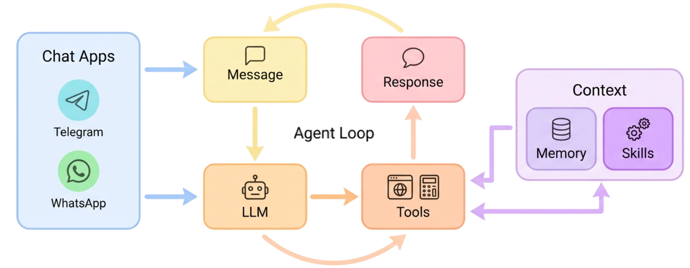

<picture>
  <source media="(prefers-color-scheme: dark)" srcset="./images/readme-cover-dark.png">
  
</picture>

<div align="center">
  <p>
    <a href="https://nanobot.wiki/docs/latest/getting-started/nanobot-overview">English</a> |
    <a href="https://nanobot.wiki/cn/docs/latest/getting-started/nanobot-overview">简体中文</a> |
    <a href="https://nanobot.wiki/zh-Hant/docs/latest/getting-started/nanobot-overview">繁體中文</a> |
    <a href="https://nanobot.wiki/es/docs/latest/getting-started/nanobot-overview">Español</a> |
    <a href="https://nanobot.wiki/fr/docs/latest/getting-started/nanobot-overview">Français</a> |
    <a href="https://nanobot.wiki/id/docs/latest/getting-started/nanobot-overview">Bahasa Indonesia</a> |
    <a href="https://nanobot.wiki/ja/docs/latest/getting-started/nanobot-overview">日本語</a> |
    <a href="https://nanobot.wiki/ko/docs/latest/getting-started/nanobot-overview">한국어</a> |
    <a href="https://nanobot.wiki/ru/docs/latest/getting-started/nanobot-overview">Русский</a> |
    <a href="https://nanobot.wiki/vi/docs/latest/getting-started/nanobot-overview">Tiếng Việt</a>
  </p>
  <p>
    <a href="https://pypi.org/project/nanobot-ai/"></a>
    <a href="https://pepy.tech/project/nanobot-ai"></a>
    
    
    <a href="https://github.com/HKUDS/nanobot/graphs/commit-activity" target="_blank">
        </a>
    <a href="https://github.com/HKUDS/nanobot/issues?q=is%3Aissue%20is%3Aclosed" target="_blank">
        </a>
    <a href="https://twitter.com/intent/follow?screen_name=nanobot_project" target="_blank">
        </a>
    <a href="https://nanobot.wiki/docs/latest/getting-started/nanobot-overview"></a>
    <a href="./COMMUNICATION.md"></a>
    <a href="./COMMUNICATION.md"></a>
    <a href="https://discord.gg/MnCvHqpUGB"></a>
  </p>
</div>

🐈 **nanobot** 是一个开源、超轻量的个人 AI agent，你可以真正拥有它。它保持 agent 核心小巧且可读，同时为你提供真实长时间运行工作所需的实用组件：WebUI、聊天渠道、工具、记忆、MCP、模型路由、自动化和部署。

## 从这里开始

| 你想要... | 前往 |
|---|---|
| 在没有终端/配置基础的情况下安装 nanobot | [无技术背景上手](./docs/start-without-technical-background.md) |
| 快速安装并获得一次 CLI 回复 | [安装](#-install) 和 [快速开始](#-quick-start) |
| CLI 工作后打开内置浏览器 UI | [WebUI](#-webui) |
| 连接 Telegram、Discord、WeChat、Slack、Email 或其他聊天应用 | [聊天应用](./docs/chat-apps.md) |
| 配置 provider、fallback 模型、Langfuse、MCP、Web 工具或安全设置 | [文档](./docs/README.md) 和 [配置](./docs/configuration.md) |
| 理解或扩展内部机制 | [架构](./docs/architecture.md) 和 [开发](./docs/development.md) |

## 开源合作伙伴

<p align="center">
  <a href="https://platform.kimi.com?aff=nanobot"><picture><source media="(prefers-color-scheme: dark)" srcset="https://kimi-file.moonshot.cn/prod-chat-kimi/kfs/4/1/2026-06-05/1d8h69mt3v89kkekg24gg"></picture></a>
  <a href="https://platform.minimaxi.com/subscribe/token-plan?code=GILTJpMTqZ&source=link"></a>
</p>

## 📢 动态

- **2026-06-20** 💬 Telegram 富文本消息，更安全的 SDK 并发，更流畅的快速开始。
- **2026-06-19** 🔎 Firecrawl 应用，OpenAI 图像编辑，更安全的会话删除。
- **2026-06-18** 💬 Feishu 恢复，Keenable 搜索，Mistral 优化，工作区感知的 git。
- **2026-06-17** 🧠 默认空闲自动压缩，更清晰的 `/dream`，macOS 安装器修复。
- **2026-06-16** 🎯 更新的目标上下文，Kimi K2.7 思考，更干净的 API 重试。
- **2026-06-15** 📱 移动端 WebUI 优化，可选文件工具，真实 API 用量。
- **2026-06-14** 🖼️ 主题封面，合作伙伴链接，更强的 Codex 图像流。
- **2026-06-13** 🗓️ 会话绑定的自动化，更稳固的 WhatsApp，更快的 WebUI 启动。
- **2026-06-12** 💬 Slack 白名单渠道可以要求提及。
- **2026-06-11** ✂️ 围栏代码块消息拆分。

<details>
<summary>早期动态</summary>

- **2026-06-10** 📜 分段转写，Exa/Bocha 搜索，StepFun/SiliconFlow ASR。
- **2026-06-09** 🎙️ 共享语音输入，更多 STT provider，TeX 和邮件优化。
- **2026-06-08** 🧮 Token 热图修复，更安全的 MCP HTTP 探测，文档清理。
- **2026-06-06** 🧰 SDK MCP 清理，可移除的 OpenAI 图像默认值。
- **2026-06-05** 🖼️ Azure AAD，自定义图像 provider，`/skill`，更稳定的配对。
- **2026-06-04** 🔌 MCP 重连，`uv pip` 安装回退，QQ 配对。
- **2026-06-03** 🧠 隐藏历史恢复，更安静的邮件进度处理。
- **2026-06-02** 📬 邮件附件，Napcat QQ，火山引擎搜索，更简单的 Dream。
- **2026-06-01** 🚀 发布 **v0.2.1** - **The Workbench Release** 将打包的 WebUI 变成日常 agent 工作台：更清晰的 Thought/响应时间线，实时文件编辑活动，项目工作区，模型和上下文控制，更稳定的持续目标，CLI Apps + MCP 扩展，以及更广泛的 provider/渠道支持。详情请参见[发布说明](https://github.com/HKUDS/nanobot/releases/tag/v0.2.1)。
- **2026-05-30** 🔐 更安全的 Matrix 验证，有界的媒体下载，更清晰的 WebUI 模型时间线。
- **2026-05-29** 🧩 扩展注册表，上下文窗口调优，文档提取控制。
- **2026-05-28** 🗂️ 项目工作区，访问控制，更稳定的目标和流式传输。
- **2026-05-27** ⏱️ Codex 流在长时间运行时尊重空闲超时。
- **2026-05-26** 📡 Telegram webhooks，刷新的 Kagi 搜索，更干净的传输错误。
- **2026-05-25** 🔌 统一的 CLI Apps 和 MCP，Step Plan 支持，更稳定的持续目标。
- **2026-05-24** 🧰 MCP 预设，更丰富的 slash 操作，可配置的 OpenAI 兼容请求。
- **2026-05-23** 🖼️ 智谱图像生成，更长的执行窗口，更干净的转写配置。
- **2026-05-22** 🛠️ CLI Apps，更多图像 provider，更安全的 Web 重定向和编辑。
- **2026-05-21** ⚡ Novita provider，更快的侧边栏，更流畅的编码工具和 Weixin 回复。
- **2026-05-20** 📶 Signal 渠道，更快的网关启动，多语言 README 链接。
- **2026-05-19** 🎨 图像 provider 注册表，StepFun 和 Skywork，更强的 WebUI 控制。
- **2026-05-18** 🖌️ Gemini 和 MiniMax 图像，Ant Ling，实时文件编辑活动。
- **2026-05-17** 🌊 更流畅的 WebUI 流式传输，AutoCompact 修复，缓冲的 CLI 推理。
- **2026-05-16** 🧠 Atomic Chat provider，目标感知超时，更安全的 exec URL 处理。
- **2026-05-15** 🚀 发布 **v0.2.0** - **`/goal`** 跨轮次保持持续目标，WebUI 现在内置于 wheel 中，端到端图像生成，5 个带 `fallback_models` 的新 provider，以及真正的 agent 循环重构。详情请参见[发布说明](https://github.com/HKUDS/nanobot/releases/tag/v0.2.0)。
- **2026-05-14** 🎯 **`/goal`** 用于长期目标，可见的多步骤进度，聊天中的长周期任务。
- **2026-05-13** 🧠 答案前的流式推理，自动备份模型，更流畅的插件重连。
- **2026-05-12** 🎛️ 保存的模型预设带 WebUI 徽章，更简单的插件工具，更安静的 Feishu 话题线程。
- **2026-05-11** 🖥️ NVIDIA NIM 支持，终端 bot 名称和图标，流式推理和 MiMo 切换清晰度。
- **2026-05-09** 🖼️ 更清晰的图像回放，Settings 中自带 Web 搜索密钥，Feishu 线程路由更干净。
- **2026-05-08** ✨ 聊天内联图像，重新设计的 Settings 和密钥，Dream 记忆与可见历史对齐。
- **2026-05-07** 📜 WebUI 中区域感知的 slash 面板，局域网登录，忠实的 HTTP 流式响应。
- **2026-05-06** 🧩 可调的工具提示，更稳定的语音和插件启动，持久的日程和提醒。
- **2026-05-05** 🛡️ 对未知 Telegram 聊天静默拒绝，Dream 清理，更完整的自动化摘要。
- **2026-05-04** 🔐 更安全的 DingTalk 出站媒体链接，持久的 cron 持久化，DeepSeek 优化。
- **2026-05-03** ⚙️ 可预测的 shell 白名单行为，回复中途的隔离聊天，更干净的交互式重试。
- **2026-05-02** 🐈 LongCat 支持，更智能的 token 大小提示，更清晰的捆绑升级指引。
- **2026-05-01** ☁️ 原生 AWS Bedrock provider，更紧密的 helper 交接和限定范围的会话文件。
- **2026-04-30** 💬 Feishu 线程尊重回复和话题，WhatsApp bridge 在源码编辑时刷新。
- **2026-04-29** 🚀 发布 **v0.1.5.post3** - Feishu、Discord、Slack 和 Teams 上更智能的线程；**DeepSeek-V4**；Hugging Face 和 Olostep；choices、`/history` 和更稳定的长对话。详情请参见[发布说明](https://github.com/HKUDS/nanobot/releases/tag/v0.1.5.post3)。
- **2026-04-28** 🌐 Olostep Web 搜索，Hugging Face provider，更安全的工作区工具中断。
- **2026-04-27** 💬 `/history` 命令，更智能的会话重放上限，更流畅的 Discord / Slack 线程。
- **2026-04-26** 🧭 自然的 cron 提醒，线程感知的重启，更安全的本地 provider 和 shell 行为。
- **2026-04-25** 🧩 `ask_user` choices，macOS LaunchAgent 部署，MSTeams 过期引用清理。
- **2026-04-24** 🎥 渠道视频附件，DeepSeek 思考控制，更快的文档启动。
- **2026-04-23** 🧵 Discord 线程会话，Telegram 内联按钮，结构化工具进度更新。
- **2026-04-22** 🔎 GitHub Copilot GPT-5 / o 系列支持，可配置的 Web 抓取，WebUI 图像上传。
- **2026-04-21** 🚀 发布 **v0.1.5.post2** - Windows 和 Python 3.14 支持，Office 文档读取，OpenAI 兼容 API 的 SSE 流式传输，以及跨会话、记忆和渠道的更强可靠性。详情请参见[发布说明](https://github.com/HKUDS/nanobot/releases/tag/v0.1.5.post2)。
- **2026-04-20** 🎨 Kimi K2.6 支持，Telegram 长消息拆分，WebUI 排版和深色模式优化。
- **2026-04-19** 🌐 WebUI i18n 区域切换器，带自动修复的原子会话写入。
- **2026-04-18** 🧪 初始 WebUI 聊天，更智能的设置向导菜单，WebSocket 多聊天多路复用。
- **2026-04-17** 🪟 Windows 和 Python 3.14 CI，Dream 血缘记忆，邮件自循环保护。
- **2026-04-16** 📡 OpenAI 兼容 API 的 SSE 流式传输，Discord 渠道白名单。
- **2026-04-15** 🎛️ LM Studio 和可空 API 密钥，MiniMax 思考端点，运行时 SelfTool。
- **2026-04-14** 🚀 发布 **v0.1.5.post1** - Dream 技能发现，轮次中跟进注入，WebSocket 渠道，以及更深度的渠道集成。详情请参见[发布说明](https://github.com/HKUDS/nanobot/releases/tag/v0.1.5.post1)。
- **2026-04-13** 🛡️ Agent 轮次加固 - 用户消息提前持久化，自动压缩跳过活动任务。
- **2026-04-12** 🔒 Lark 全球域名支持，Dream 学习发现的技能，shell 沙箱收紧。
- **2026-04-11** ⚡ 上下文压缩即时缩小会话；Kagi Web 搜索；QQ 和 WeCom 完整媒体。
- **2026-04-10** 📓 多个 MCP 服务器，Feishu 流式传输和完成表情。
- **2026-04-09** 🔌 WebSocket 渠道，统一跨渠道会话，`disabled_skills` 配置。
- **2026-04-08** 📤 API 文件上传，OpenAI 推理自动路由带 Responses 回退。
- **2026-04-07** 🧠 Anthropic 自适应思考，MCP 资源和提示作为工具暴露。
- **2026-04-06** 🛰️ Langfuse 可观测性，统一 Whisper 转写，邮件附件。
- **2026-04-05** 🚀 发布 **v0.1.5** - 更稳固的长时间运行任务，Dream 两阶段记忆，生产就绪的沙箱和编程 Agent SDK。详情请参见[发布说明](https://github.com/HKUDS/nanobot/releases/tag/v0.1.5)。
- **2026-04-04** 🚀 Jinja2 响应模板，Dream 记忆加固，更智能的重试处理。
- **2026-04-03** 🧠 小米 MiMo provider，思维链推理可见，Telegram UX 优化。
- **2026-04-02** 🧱 长时间运行任务更可靠 - 核心运行时加固。
- **2026-04-01** 🔑 GitHub Copilot 认证恢复；更严格的工作区路径；OpenRouter Claude 缓存修复。
- **2026-03-31** 🛰️ WeChat 多模态对齐，Discord/Matrix 优化，Python SDK facade，MCP 和工具修复。
- **2026-03-30** 🧩 OpenAI 兼容 API 收紧；可组合的 agent 生命周期钩子。
- **2026-03-29** 💬 WeChat 语音、输入、二维码/媒体韧性；固定会话的 OpenAI 兼容 API。
- **2026-03-28** 📚 Provider 文档刷新；技能模板措辞修复。
- **2026-03-27** 🚀 发布 **v0.1.4.post6** - 架构解耦，移除 litellm，端到端流式传输，WeChat 渠道，以及一个安全修复。详情请参见[发布说明](https://github.com/HKUDS/nanobot/releases/tag/v0.1.4.post6)。
- **2026-03-26** 🏗️ Agent runner 提取并统一生命周期钩子；边界处的流增量合并。
- **2026-03-25** 🌏 StepFun provider，可配置时区，Gemini 思维签名。
- **2026-03-24** 🔧 WeChat 兼容性，Feishu CardKit 流式传输，测试套件重构。
- **2026-03-23** 🔧 命令路由为插件重构，WhatsApp/WeChat 媒体，统一渠道登录 CLI。
- **2026-03-22** ⚡ 端到端流式传输，WeChat 渠道，Anthropic 缓存优化，`/status` 命令。
- **2026-03-21** 🔒 用原生 `openai` + `anthropic` SDK 替换 `litellm`。请参见[提交](https://github.com/HKUDS/nanobot/commit/3dfdab7)。
- **2026-03-20** 🧙 交互式设置向导 - 选择你的 provider，模型自动补全，即可开始使用。
- **2026-03-19** 💬 Telegram 在负载下更有韧性；Feishu 现在能正确渲染代码块。
- **2026-03-18** 📷 Telegram 现在可以通过 URL 发送媒体。Cron 日程显示人类可读的详情。
- **2026-03-17** ✨ Feishu 格式化大幅改进，Slack 完成时回应，自定义端点支持额外头部，图像处理更可靠。
- **2026-03-16** 🚀 发布 **v0.1.4.post5** - 一个以改进为重点的版本，具有更强的可靠性和渠道支持，以及更可靠的日常体验。详情请参见[发布说明](https://github.com/HKUDS/nanobot/releases/tag/v0.1.4.post5)。
- **2026-03-15** 🧩 DingTalk 富媒体，更智能的内置技能，以及更干净的模型兼容性。
- **2026-03-14** 💬 渠道插件，Feishu 回复，以及更稳定的 MCP、QQ 和媒体处理。
- **2026-03-13** 🌐 多 provider Web 搜索，LangSmith，以及更广泛的可靠性改进。
- **2026-03-12** 🚀 火山引擎支持，Telegram 回复上下文，`/restart`，以及更稳固的记忆。
- **2026-03-11** 🔌 WeCom，Ollama，更干净的发现，以及更安全的工具行为。
- **2026-03-10** 🧠 基于 token 的记忆，共享重试，以及更干净的网关和 Telegram 行为。
- **2026-03-09** 💬 Slack 线程优化和更好的 Feishu 音频兼容性。
- **2026-03-08** 🚀 发布 **v0.1.4.post4** - 一个主打可靠性的版本，具有更安全的默认值、更好的多实例支持、更稳固的 MCP，以及重大的渠道和 provider 改进。详情请参见[发布说明](https://github.com/HKUDS/nanobot/releases/tag/v0.1.4.post4)。
- **2026-03-07** 🚀 Azure OpenAI provider，WhatsApp 媒体，QQ 群聊，以及更多 Telegram/Feishu 优化。
- **2026-03-06** 🪄 更轻量的 provider，更智能的媒体处理，以及更稳固的记忆和 CLI 兼容性。
- **2026-03-05** ⚡️ Telegram 草稿流式传输，MCP SSE 支持，以及更广泛的渠道可靠性修复。
- **2026-03-04** 🛠️ 依赖清理，更安全的文件读取，以及又一轮测试和 Cron 修复。
- **2026-03-03** 🧠 更干净的用户消息合并，更安全的多模态保存，以及更强的 Cron 守卫。
- **2026-03-02** 🛡️ 更安全的默认访问控制，更稳固的 Cron 重载，以及更干净的 Matrix 媒体处理。
- **2026-03-01** 🌐 Web 代理支持，更智能的 Cron 提醒，以及 Feishu 富文本解析改进。
- **2026-02-28** 🚀 发布 **v0.1.4.post3** - 更干净的上下文，加固的会话历史，以及更智能的 agent。详情请参见[发布说明](https://github.com/HKUDS/nanobot/releases/tag/v0.1.4.post3)。
- **2026-02-27** 🧠 实验性思考模式支持，DingTalk 媒体消息，Feishu 和 QQ 渠道修复。
- **2026-02-26** 🛡️ 会话中毒修复，WhatsApp 去重，Windows 路径守卫，Mistral 兼容性。
- **2026-02-25** 🧹 新的 Matrix 渠道，更干净的会话上下文，自动工作区模板同步。
- **2026-02-24** 🚀 发布 **v0.1.4.post2** - 一个以可靠性为重点的版本，具有重新设计的心跳、提示缓存优化，以及加固的 provider 和渠道稳定性。详情请参见[发布说明](https://github.com/HKUDS/nanobot/releases/tag/v0.1.4.post2)。
- **2026-02-23** 🔧 虚拟工具调用心跳，提示缓存优化，Slack mrkdwn 修复。
- **2026-02-22** 🛡️ Slack 线程隔离，Discord 输入修复，agent 可靠性改进。
- **2026-02-21** 🎉 发布 **v0.1.4.post1** - 新 provider，跨渠道媒体支持，以及重大稳定性改进。详情请参见[发布说明](https://github.com/HKUDS/nanobot/releases/tag/v0.1.4.post1)。
- **2026-02-20** 🐦 Feishu 现在可以接收用户的多模态文件。底层记忆更可靠。
- **2026-02-19** ✨ Slack 现在可以发送文件，Discord 拆分长消息，子 agent 在 CLI 模式下工作。
- **2026-02-18** ⚡️ nanobot 现在支持火山引擎、MCP 自定义认证头部和 Anthropic 提示缓存。
- **2026-02-17** 🎉 发布 **v0.1.4** - MCP 支持，进度流式传输，新 provider，以及多项渠道改进。详情请参见[发布说明](https://github.com/HKUDS/nanobot/releases/tag/v0.1.4)。
- **2026-02-16** 🦞 nanobot 现在集成了 [ClawHub](https://clawhub.ai) 技能 - 搜索和安装公共 agent 技能。
- **2026-02-15** 🔑 nanobot 现在支持 OpenAI Codex provider，带 OAuth 登录支持。
- **2026-02-14** 🔌 nanobot 现在支持 MCP！详情请参见 [MCP 部分](./docs/configuration.md#mcp-model-context-protocol)。
- **2026-02-13** 🎉 发布 **v0.1.3.post7** - 包含安全加固和多项改进。**请升级到最新版本以解决安全问题**。更多详情请参见[发布说明](https://github.com/HKUDS/nanobot/releases/tag/v0.1.3.post7)。
- **2026-02-12** 🧠 重新设计的记忆系统 - 更少代码，更可靠。加入关于它的[讨论](https://github.com/HKUDS/nanobot/discussions/566)！
- **2026-02-11** ✨ 增强的 CLI 体验并添加了 MiniMax 支持！
- **2026-02-10** 🎉 发布 **v0.1.3.post6** 带来多项改进！查看更新[说明](https://github.com/HKUDS/nanobot/releases/tag/v0.1.3.post6)和我们的[路线图](https://github.com/HKUDS/nanobot/discussions/431)。
- **2026-02-09** 💬 添加了 Slack、Email 和 QQ 支持 - nanobot 现在支持多个聊天平台！
- **2026-02-08** 🔧 重构了 Provider - 添加一个新的 LLM provider 现在只需 2 个简单步骤！查看[这里](./docs/configuration.md#providers)。
- **2026-02-07** 🚀 发布 **v0.1.3.post5** 带来 Qwen 支持和几项关键改进！详情查看[这里](https://github.com/HKUDS/nanobot/releases/tag/v0.1.3.post5)。
- **2026-02-06** ✨ 添加了 Moonshot/Kimi provider、Discord 集成，并增强了安全加固！
- **2026-02-05** ✨ 添加了 Feishu 渠道、DeepSeek provider，并增强了定时任务支持！
- **2026-02-04** 🚀 发布 **v0.1.3.post4** 带来多 provider 和 Docker 支持！详情查看[这里](https://github.com/HKUDS/nanobot/releases/tag/v0.1.3.post4)。
- **2026-02-03** ⚡ 集成 vLLM 用于本地 LLM 支持并改进了自然语言任务调度！
- **2026-02-02** 🎉 nanobot 正式发布！欢迎试用 🐈 nanobot！

</details>


## 💡 为什么选择 nanobot

- **持久的工作流**：目标、记忆、工具和聊天上下文在长时间运行的工作中得以保留。
- **聊天原生覆盖**：WebUI、API、Telegram、Feishu、Slack、Discord、Teams 和 Email。
- **模型自由**：OpenAI 兼容 API、本地 LLM、图像生成、搜索和回退。
- **小巧核心**：可读的内部实现，内置 MCP、记忆、部署和自动化。
- **拥有你的技术栈**：检查、自定义、自托管和扩展，无需庞大的平台。

## 📦 安装

> [!IMPORTANT]
> 如果你想要最新的功能和实验特性，请从源码安装。
>
> 如果你想要最稳定的日常体验，请从 PyPI 或使用 `uv` 安装。

选择**一种**安装方式：

前置条件：Python 3.11 或更高版本。Git 仅在源码安装时需要；Node.js/Bun 仅在你开发 WebUI 本身时需要。

如果终端、API 密钥或配置文件对你来说是新事物，请使用[无技术背景上手](./docs/start-without-technical-background.md)中的引导式零基础指南，而不是这个精简的 README 路径。

**一键设置**

macOS / Linux：

```bash
curl -fsSL https://raw.githubusercontent.com/HKUDS/nanobot/main/scripts/install.sh | sh
```

Windows PowerShell：

```powershell
irm https://raw.githubusercontent.com/HKUDS/nanobot/main/scripts/install.ps1 | iex
```

默认命令从 PyPI 安装或升级 `nanobot-ai`，然后启动 `nanobot onboard --wizard`。它通过使用活动的虚拟环境、`uv`、`pipx` 或 `~/.nanobot/venv` 下的托管 venv 来避免系统范围的 pip 安装。如果快速开始完成并且你启用了 WebSocket 渠道，请跳过下面的手动初始化/配置步骤，直接进入**打开 WebUI**。

要在不更改环境的情况下预览计划，请传入 `--dry-run`；当你想预览 main 分支安装时，将其与 `--dev` 结合使用。

```bash
curl -fsSL https://raw.githubusercontent.com/HKUDS/nanobot/main/scripts/install.sh | sh -s -- --dry-run
```

```powershell
& ([scriptblock]::Create((irm https://raw.githubusercontent.com/HKUDS/nanobot/main/scripts/install.ps1))) --dry-run
```

要改为安装当前的 `main` 分支，请传入 `--dev`：

```bash
curl -fsSL https://raw.githubusercontent.com/HKUDS/nanobot/main/scripts/install.sh | sh -s -- --dev
```

```powershell
& ([scriptblock]::Create((irm https://raw.githubusercontent.com/HKUDS/nanobot/main/scripts/install.ps1))) --dev
```

如果你更愿意先检查脚本，请打开 [`scripts/install.sh`](./scripts/install.sh) 或 [`scripts/install.ps1`](./scripts/install.ps1)。

**使用 `uv` 安装**

```bash
uv tool install nanobot-ai
```

**使用 pip 从 PyPI 安装**

```bash
python -m pip install nanobot-ai
```

如果 pip 在 macOS 或 Linux 上报告 `externally-managed-environment`，请使用一键安装器、`uv tool install nanobot-ai`、`pipx install nanobot-ai`，或在虚拟环境中安装。

**从源码安装**

```bash
git clone https://github.com/HKUDS/nanobot.git
cd nanobot
python -m pip install -e .
```

验证安装：

```bash
nanobot --version
```

## 🚀 快速开始

**1. 初始化**

如果一键设置已经启动了向导并且快速开始在那里完成，请跳过此步骤。

```bash
nanobot onboard
```

如果你更喜欢交互式设置，请使用 `nanobot onboard --wizard`。

**2. 配置** (`~/.nanobot/config.json`)

如果你已经在向导中配置了 provider 和模型设置，请跳过此步骤。

`nanobot onboard` 会创建 `~/.nanobot/config.json` 和 `~/.nanobot/workspace/`。在配置文件中配置这**两个部分**。将以下块添加或合并到现有文件中，而不是替换整个文件。

下面的示例使用通用的 OpenAI 兼容 `custom` provider，这样精简路径就不会推荐某个托管服务。Provider 示例是配方，而非排名或背书。如需可复制的特定 provider 设置，请参见 [Provider Cookbook](./docs/provider-cookbook.md)。

*设置你的 API 密钥*：

```json
{
  "providers": {
    "custom": {
      "apiKey": "your-api-key",
      "apiBase": "https://api.example.com/v1"
    }
  }
}
```

*设置模型预设并激活它*：

```json
{
  "modelPresets": {
    "primary": {
      "label": "Primary",
      "provider": "custom",
      "model": "model-id-from-your-provider",
      "maxTokens": 8192,
      "contextWindowTokens": 200000,
      "temperature": 0.1
    }
  },
  "agents": {
    "defaults": {
      "modelPreset": "primary"
    }
  }
}
```

直接使用 `agents.defaults.provider` 和 `agents.defaults.model` 对现有配置仍然有效，但命名预设是推荐路径，因为它们还支持 `/model` 切换和 `fallbackModels`。

对于其他 provider，同样的配置结构仍然适用：

| 替换 | 位置 |
|---|---|
| Provider 配置键 | `providers.<provider>` |
| API 密钥 | `providers.<provider>.apiKey` |
| 预设 provider 名称 | `modelPresets.primary.provider` |
| 模型 ID | `modelPresets.primary.model` |
| 端点 URL，仅在需要时 | `providers.<provider>.apiBase` |

**3. 打开 WebUI**

如果快速开始启用了 WebSocket 渠道，请启动网关：

```bash
nanobot gateway
```

保持该终端打开，然后在浏览器中打开 `http://127.0.0.1:8765`。输入你在向导中设置的 WebUI 密码，然后在那里发送你的第一条消息。
不想保持终端打开？使用 `nanobot gateway --background`，然后用 `nanobot gateway status`、`logs`、`restart` 和 `stop` 管理它。

对于手动或仅终端的设置，测试一条 CLI 消息：

```bash
nanobot status
nanobot agent -m "Hello!"
```

在 `nanobot status` 中，大多数 provider 显示 `not set` 是正常的。活动预设的 provider 应该已配置，并且 `Config` 和 `Workspace` 应该显示勾号。

如果正常，启动交互式聊天：

```bash
nanobot agent
```

在 `PATH`、API 密钥、provider/模型匹配或 JSON 错误方面需要帮助？请参见更完整的[安装和快速开始](./docs/quick-start.md)和[故障排除](./docs/troubleshooting.md)。

- 想要可粘贴的 provider 设置？请参见 [Provider Cookbook](./docs/provider-cookbook.md)
- 想了解 provider/模型匹配？请参见 [Provider 和模型](./docs/providers.md)
- 想要 Web 搜索、MCP、安全设置或更多配置选项？请参见[配置](./docs/configuration.md)
- 想在本地运行？请参见 [Ollama](./docs/providers.md#ollama)、[vLLM 或其他本地 OpenAI 兼容服务器](./docs/providers.md#vllm-or-other-local-openai-compatible-server)，以及完整的 [provider 参考](./docs/configuration.md#providers)。
- 想在 Telegram、Discord、WeChat 或 Feishu 等聊天应用中运行 nanobot？请参见[聊天应用](./docs/chat-apps.md)
- 想要 Docker 或 Linux 服务部署？请参见[部署](./docs/deployment.md)

## 🌐 WebUI

WebUI **内置于发布的 wheel 中** - 无需额外构建步骤。它是用于聊天会话、工作区控制、Apps、Skills、Automations 和设置的浏览器工作台。完整的用户指南请参见 [`docs/webui.md`](./docs/webui.md)。

<p align="center">
  
</p>

**1. 在 `~/.nanobot/config.json` 中启用 WebSocket 渠道**

将此块合并到你现有的配置中：

```json
{
  "channels": {
    "websocket": {
      "enabled": true,
      "tokenIssueSecret": "your-webui-password",
      "websocketRequiresToken": true
    }
  }
}
```

**2. 启动网关**

```bash
nanobot gateway
```

使用 `nanobot gateway --background` 获得一个本地后台进程，之后可以用 `nanobot gateway status`、`logs`、`restart` 和 `stop` 管理。

**3. 打开 WebUI**

在浏览器中访问 [`http://127.0.0.1:8765`](http://127.0.0.1:8765)。要从局域网上的其他设备打开它，请参见 [WebUI 文档 -> 局域网访问](./docs/webui.md#lan-access)。

WebUI 默认由 WebSocket 渠道在端口 `8765` 上提供服务。网关的 `18790` 端口用于健康端点，而非浏览器 UI。

> [!TIP]
> 在开发 WebUI 本身？请查看 [`webui/README.md`](./webui/README.md) 了解源码树、Vite 开发服务器、构建和测试工作流。

## 🏗️ 架构

<p align="center">
  
</p>

🐈 nanobot 通过将一切围绕一个小型 agent 循环来保持轻量：消息从聊天应用传入，LLM 决定何时需要工具，记忆或技能仅作为上下文被引入，而不是成为一个沉重的编排层。这使得核心路径可读且易于扩展，同时仍然允许你添加渠道、工具、记忆和部署选项，而不会使系统变成一个庞然大物。

## ✨ 功能

<table align="center">
  <tr align="center">
    <th><p align="center">📈 7x24 实时市场分析</p></th>
    <th><p align="center">🚀 全栈软件工程师</p></th>
    <th><p align="center">📅 智能日常事务管理器</p></th>
    <th><p align="center">📚 个人知识助手</p></th>
  </tr>
  <tr>
    <td align="center"><p align="center"></p></td>
    <td align="center"><p align="center"></p></td>
    <td align="center"><p align="center"></p></td>
    <td align="center"><p align="center"></p></td>
  </tr>
  <tr>
    <td align="center">发现 • 洞察 • 趋势</td>
    <td align="center">开发 • 部署 • 扩展</td>
    <td align="center">日程 • 自动化 • 组织</td>
    <td align="center">学习 • 记忆 • 推理</td>
  </tr>
</table>

## 📚 文档

浏览[仓库文档](./docs/README.md)了解最新功能和 GitHub 开发版本，或访问 [nanobot.wiki](https://nanobot.wiki/docs/latest/getting-started/nanobot-overview) 查看稳定版本文档。

- 无技术背景上手：[无技术背景上手](./docs/start-without-technical-background.md)
- 从零开始带开发者基础：[安装和快速开始](./docs/quick-start.md)
- 理解运行时模型：[概念](./docs/concepts.md)
- 阅读源码级地图：[架构](./docs/architecture.md)
- 选择 provider/模型：[Provider 和模型](./docs/providers.md)
- 复制 provider 设置配方：[Provider Cookbook](./docs/provider-cookbook.md)
- 调试设置和运行时故障：[故障排除](./docs/troubleshooting.md)
- 用熟悉的聊天应用与你的 nanobot 对话：[聊天应用](./docs/chat-apps.md)
- 配置 provider、Web 搜索、MCP 和运行时行为：[配置](./docs/configuration.md)
- 将 nanobot 与本地工具和自动化集成：[OpenAI 兼容 API](./docs/openai-api.md) · [Python SDK](./docs/python-sdk.md)
- 用 Docker 或作为 Linux 服务运行 nanobot：[部署](./docs/deployment.md)

## 🤝 贡献和路线图

欢迎 PR！代码库特意保持小巧且可读。🤗

### 贡献流程

请参见 [CONTRIBUTING.md](./CONTRIBUTING.md) 了解设置、审查和贡献指南。

**路线图** - 选择一项并[提交 PR](https://github.com/HKUDS/nanobot/pulls)！

- **多模态** - 看和听（图像、语音、视频）
- **长期记忆** - 永不忘记重要上下文
- **更好的推理** - 多步骤规划和反思
- **更多集成** - 日历等
- **自我改进** - 从反馈和错误中学习

## 联系方式

本项目由 [Xubin Ren](https://github.com/re-bin) 作为个人开源项目发起，并继续以个人身份使用个人资源维护，同时有来自开源社区的贡献。如有问题、想法或合作，欢迎联系 [xubinrencs@gmail.com](mailto:xubinrencs@gmail.com)。

### 贡献者

<a href="https://github.com/HKUDS/nanobot/graphs/contributors">
  
</a>


## ⭐ Star 历史

<div align="center">
  <a href="https://star-history.com/#HKUDS/nanobot&Date">
    <picture>
      <source media="(prefers-color-scheme: dark)" srcset="https://api.star-history.com/svg?repos=HKUDS/nanobot&type=Date&theme=dark" />
      <source media="(prefers-color-scheme: light)" srcset="https://api.star-history.com/svg?repos=HKUDS/nanobot&type=Date" />
      
    </picture>
  </a>
</div>

<p align="center">
  <em> 感谢访问 ✨ nanobot！</em><br><br>
  
</p>
