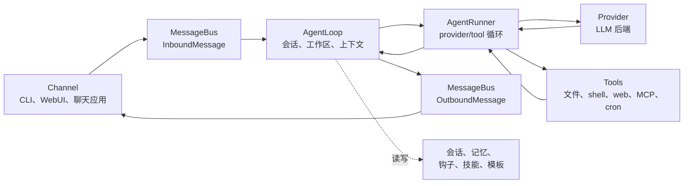

# 架构

本页面将 nanobot 的运行时行为映射到源文件。当你调试内部实现、评审 PR、添加 provider/channel/tool，或试图理解某个用户可见行为的来源时，请参考本页面。

如需产品层面的心智模型，请先阅读 [`concepts.md`](./concepts.md)。

## 核心流程



主要文件：

| 区域 | 文件 |
|---|---|
| 消息事件与队列 | `nanobot/bus/events.py`、`nanobot/bus/queue.py` |
| 轮次编排 | `nanobot/agent/loop.py` |
| Provider/tool 对话循环 | `nanobot/agent/runner.py` |
| 上下文构建 | `nanobot/agent/context.py` |
| 会话存储与压缩 | `nanobot/session/manager.py` |
| 长期记忆与 Dream | `nanobot/agent/memory.py` |

## Agent Loop 与 Agent Runner

`AgentLoop` 负责面向 channel 的轮次：

- 接收入站消息；
- 确定生效的会话与工作区范围；
- 构建上下文；
- 接入钩子、进度和 channel 元数据；
- 发布出站消息。

`AgentRunner` 负责面向模型的循环：

- 将消息发送给选定的 provider；
- 处理流式增量与 reasoning 块；
- 执行工具调用；
- 将工具结果回传给模型；
- 在产生最终回答或达到运行时限制时停止。

调试时请记住这一分工。如果问题涉及 channel 路由、会话键、工作区选择或出站投递，从 `agent/loop.py` 开始排查。如果问题涉及 provider 调用、工具调用、流式处理或迭代限制，从 `agent/runner.py` 开始排查。

## Providers

Provider 元数据集中存放在 `nanobot/providers/registry.py`。配置字段位于 `nanobot/config/schema.py`。

Provider 选择使用：

- 显式的 `agents.defaults.provider` 或预设 provider；
- provider 注册表关键词；
- API key 前缀和 API base URL 提示；
- 当配置了 `apiBase` 时的本地 provider 回退；
- 针对可路由多种模型系列的 provider 的网关回退。

Provider 实现位于 `nanobot/providers/`。大多数托管 provider 使用 OpenAI 兼容实现，而 Anthropic、Azure OpenAI、AWS Bedrock、OpenAI Codex 和 GitHub Copilot 有专用路径。

相关文档：

- [`providers.md`](./providers.md) 提供实用设置说明；
- [`configuration.md#providers`](./configuration.md#providers) 提供精确的 provider 参考。

## Channels

Channel 将外部平台转换为 `InboundMessage` 事件，并将 `OutboundMessage` 事件发送回平台。

主要文件：

| 区域 | 文件 |
|---|---|
| Channel 基类契约 | `nanobot/channels/base.py` |
| 内置 channel | `nanobot/channels/*.py` |
| 发现与生命周期 | `nanobot/channels/manager.py` |
| WebSocket/WebUI channel | `nanobot/channels/websocket.py` |

Channel 通过内置模块扫描和插件入口点发现。自定义 channel 应遵循 [`channel-plugin-guide.md`](./channel-plugin-guide.md)。

## WebUI 与 Gateway

`nanobot gateway` 启动：

- 已启用的聊天 channel；
- 配置时的 WebSocket channel；
- 工作区作用域的 cron 服务；
- 系统作业，如 Dream 和 heartbeat；
- `gateway.port` 上的健康端点。

打包的 WebUI 由 WebSocket channel 提供，而非健康端点：

| 服务 | 默认值 |
|---|---|
| 健康端点 | `http://127.0.0.1:18790/health` |
| WebUI/WebSocket | `http://127.0.0.1:8765` |

WebUI 源码位于 `webui/`。生产构建产物写入 `nanobot/web/dist/` 并打包进 wheel。

相关文档：

- [`webui.md`](./webui.md) 提供 WebUI 用户指南；
- [`../webui/README.md`](../webui/README.md) 提供前端源码开发说明；
- [`websocket.md`](./websocket.md) 提供协议细节。

## Tools

Tool 从 `nanobot/agent/tools/` 和插件入口点发现。

重要文件：

| 工具区域 | 文件 |
|---|---|
| Tool 基类与 schema | `nanobot/agent/tools/base.py`、`nanobot/agent/tools/schema.py` |
| 发现 | `nanobot/agent/tools/registry.py` |
| Shell 执行 | `nanobot/agent/tools/shell.py` |
| 文件系统工具 | `nanobot/agent/tools/filesystem.py` |
| Web 搜索/抓取 | `nanobot/agent/tools/web.py` |
| MCP 工具 | `nanobot/agent/tools/mcp.py` |
| Cron | `nanobot/agent/tools/cron.py`、`nanobot/cron/` |
| 图像生成 | `nanobot/agent/tools/image_generation.py` |
| 运行时自检 | `nanobot/agent/tools/self.py` |

工具行为是模型契约的一部分。除非有意变更，否则请保持用户可见的工具名、schema 和错误消息稳定。

## 配置与路径

配置 schema 位于 `nanobot/config/schema.py`。加载与保存位于 `nanobot/config/loader.py`。运行时路径辅助函数位于 `nanobot/config/paths.py`。

默认值：

| 路径 | 默认值 |
|---|---|
| 配置 | `~/.nanobot/config.json` |
| 工作区 | `~/.nanobot/workspace/` |
| 会话 | `<workspace>/sessions/*.jsonl` |
| 记忆 | `<workspace>/memory/` |
| Cron 存储 | `<workspace>/cron/jobs.json` |
| WebUI/媒体/日志运行时数据 | 配置目录的子目录，如 `webui/`、`media/` 和 `logs/` |

该 schema 同时接受 camelCase 和 snake_case 键，但保存配置时使用 camelCase 别名。

## 记忆与会话

会话历史是近期对话的重放。记忆是较长期的工作区状态。

| 存储 | 文件区域 |
|---|---|
| 会话 JSONL 文件 | `<workspace>/sessions/` |
| 长期记忆 | `<workspace>/memory/MEMORY.md` |
| 整合来源历史 | `<workspace>/memory/history.jsonl` |
| 引导身份文件 | `<workspace>/SOUL.md`、`<workspace>/USER.md`、`nanobot/templates/` 下的模板 |

Dream 在 `nanobot/agent/memory.py` 中实现，并在启用时由运行时调度。

## 安全边界

安全敏感的代码路径包括：

| 边界 | 文件 |
|---|---|
| 工作区作用域 | `nanobot/security/workspace_access.py`、`nanobot/security/workspace_policy.py` |
| Shell 沙箱 | `nanobot/agent/tools/shell.py` |
| SSRF/网络检查 | `nanobot/security/network.py`、`nanobot/agent/tools/web.py` |
| PTH 防护与 CLI 启动安全 | `nanobot/security/` 及 CLI 入口 |
| Channel 访问控制 | `nanobot/channels/*.py` 中的 channel 配置 |

在修改工具、channel、文件访问、WebUI 工作区行为或网络抓取时，请将安全视为功能行为的一部分，并在面向用户的边界发生变化时更新文档。

## 扩展点

| 扩展 | 方式 |
|---|---|
| Provider | 在 `providers/registry.py` 中添加 `ProviderSpec`，在 `config/schema.py` 中添加 schema 字段，仅当通用后端不够用时才实现 provider |
| Channel | 实现 `BaseChannel`，暴露一个入口点，遵循 [`channel-plugin-guide.md`](./channel-plugin-guide.md) |
| Tool | 在 `agent/tools/` 下实现工具，或暴露一个插件入口点 |
| MCP | 添加 `tools.mcpServers` 配置 |
| Skill | 在 `<workspace>/skills/` 下添加工作区技能文件，或在 `nanobot/skills/` 下添加内置技能 |

优先使用现有的注册/发现模式，而非临时接线。

## 测试与验证

常用检查：

```bash
pytest tests/test_openai_api.py::test_function -v
ruff check nanobot/
cd webui && bun run test
cd webui && bun run build
```

根据变更的表层选择测试：

| 变更 | 最小有效验证 |
|---|---|
| Provider 行为 | Provider 单元测试或 mock 的 API 路径；条件允许时使用安全配置运行 `nanobot agent -m "Hello!"` |
| Channel 行为 | Channel 测试加上 `nanobot gateway` 启动路径 |
| WebUI 行为 | WebUI 测试/构建，且对于路由/设置/聊天变更，通过网关进行浏览器级验证 |
| Tool 行为 | Tool 单元测试，且当 schema 或面向模型的行为变更时运行 agent 路径 |
| 文档 | 链接检查、对照 CLI/schema 的命令准确性，以及 `git diff --check` |

对于面向用户的流程，至少应有一条通过用户实际接触的公共表层的验证路径：CLI 命令、HTTP 端点、WebSocket/WebUI、聊天 channel 或打包导入。
